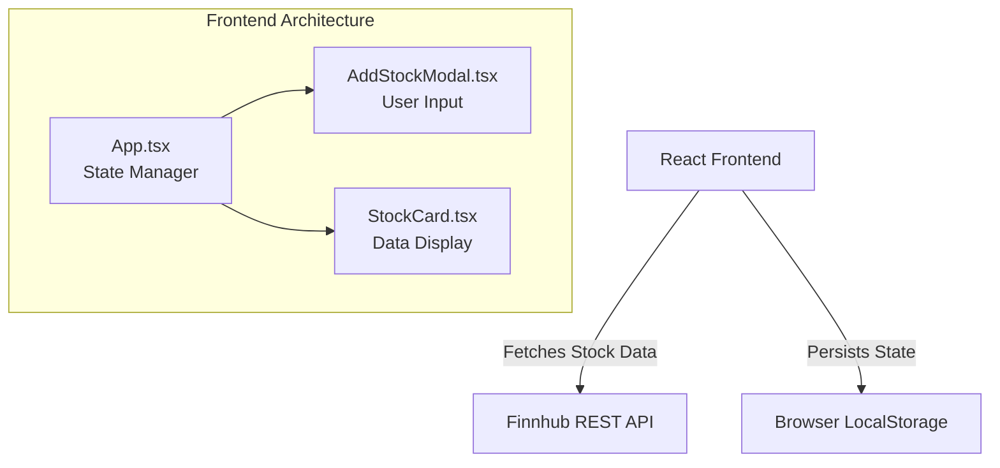
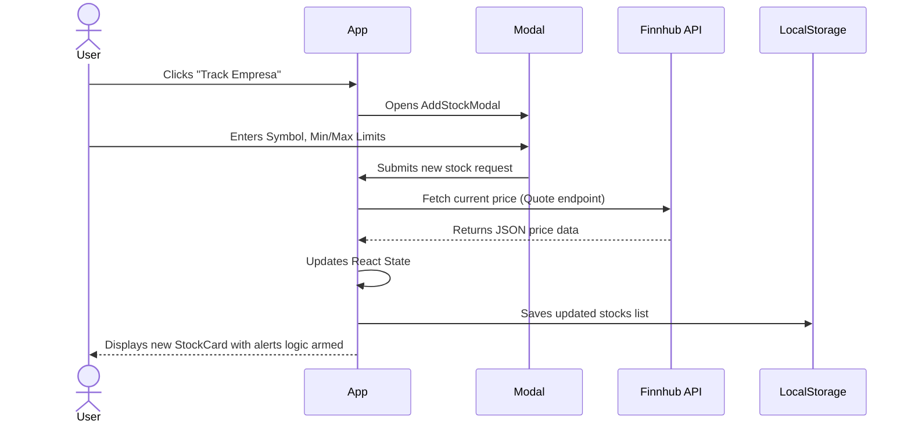

# 🚀 Project Summary: Kawaii Stocks

> Generated by Antigravity AI on 2026-03-20

## 📝 Overview

**Kawaii Stocks** is a user-friendly, real-time stock tracking web application designed with a "kawaii" (cute) aesthetic. 

**Problem it solves:** Traditional financial and stock-tracking applications often feel intimidating, sterile, or overly complex for casual investors. Kawaii Stocks simplifies the experience, providing essential tracking features (like current prices and custom price-drop/surge notifications) in a welcoming, visually pleasing interface.
**Target audience:** Casual investors, beginners in the stock market, or anyone who prefers a softer, stress-free design when monitoring their financial assets.

## 🛠 Tech Stack

- **Language:** TypeScript (`~5.8.2`)
- **Framework:** React 19 (`^19.0.0`) bootstrapped natively via Vite (`^6.2.0`)
- **Styling:** Tailwind CSS (`^4.1.14`) configured for a custom pastel color palette and Google Fonts (Quicksand, Sniglet).
- **Icons & Animations:** Lucide React (`^0.546.0`) for crisp iconography, and Motion / Framer Motion (`^12.23.24`) for smooth component transitions.
- **External Integration:** Finnhub REST API for fetching real-time market quotes.
- **State Management:** React hooks with persistence to the browser's `localStorage`.

## 📂 Project Structure

```text
c:\Users\carlo\Documents\VisualStudioCode\Proyectos\stock-tracker/
├── public/                 # Static assets (icon-sakura-branch.png, icon-sakura.png)
├── src/                    # Main application source code
│   ├── components/         # Reusable React components
│   │   ├── AddStockModal.tsx   # Modal for adding new tickers and alerts
│   │   └── StockCard.tsx       # Individual card displaying stock price & status
│   ├── App.tsx             # Main entry point for layout and state logic
│   ├── index.css           # Global styles and Tailwind configuration
│   ├── main.tsx            # React DOM rendering entry point
│   └── types.ts            # TypeScript interfaces (Stock, Notification)
├── index.html              # HTML entry point for the Vite app
├── package.json            # Project dependencies and script runner (dev, build)
├── tsconfig.json           # TypeScript compiler configuration
└── vite.config.ts          # Vite bundler configuration
```

## 🏗 Architecture & Logic

### High-Level Architecture



### User Flow



## 🧪 Testing & QA

Currently, the project focuses on static type-checking and manual verification. Below are 3 critical test cases to ensure reliability:

1. **Happy Path - Adding a Valid Stock:**
   - *Action:* Open the modal and add a valid ticker (e.g., `AAPL` or `NASDAQ: AAPL`), set limits, and save.
   - *Expected:* The app cleans the string, fetches the price, saves the object to `localStorage`, and displays the new `StockCard`.
2. **Edge Case - Invalid Ticker Input:**
   - *Action:* Try to add a non-existent stock symbol.
   - *Expected:* Finnhub returns `{ c: 0 }`. The app detects this fallback, prevents the addition, and shows an `alert` informing the user that the symbol could not be found.
3. **Edge Case - Triggering Price Notifications:**
   - *Action:* Add a stock with a minimum limit strictly greater than the current market price and wait for the 10-minute fetch cycle (or simulate an API update).
   - *Expected:* A red toast notification drops down indicating the stock went below the minimum limit (`"¡[Symbol] bajó de $[Limit]! 📉"`).

> *Note: There is currently no automated test runner configured. The command `npm run lint` guarantees strict TypeScript bounds.*

## 🔍 AI Engineering Insights

- **Performance Audit:** The application polls the Finnhub API every 10 minutes to update prices. Currently, it uses a sequential `for` loop `await fetchStockPrice(...)`. For a small number of stocks, this is acceptable, but it could limit performance as the list grows. Batching or executing concurrent promises would speed up the update cycle significantly.
- **Security Posture:** An API Key for Finnhub is hardcoded directly inside `App.tsx` (`const FINNHUB_API_KEY = ...`). Although commented as "just for personal testing", this exposes the key in client-side bundles and GitHub repositories. 
- **Maintenance Score:** **High**. The codebase has excellent modularity. It effectively leverages React functional components, hooks, and clean TypeScript typings (`types.ts`). Further abstraction of the Finnhub API logic into a separate `services/api.ts` file could raise the score.

---

## 🔄 Next Steps

- **Security & Configuration:** Move `FINNHUB_API_KEY` to a `.env` file (e.g., `VITE_FINNHUB_API_KEY`) to prevent secrets exposure in version control.
- **Performance Refactor:** Refactor the polling interval function in `App.tsx` (`updatePrices`) to use `Promise.all()` to fetch all stock prices concurrently instead of sequentially.
- **Testing Implementation:** Introduce a testing framework (e.g., Vitest paired with React Testing Library) to automate the specified test cases, specially around the notification trigger logic boundaries.
